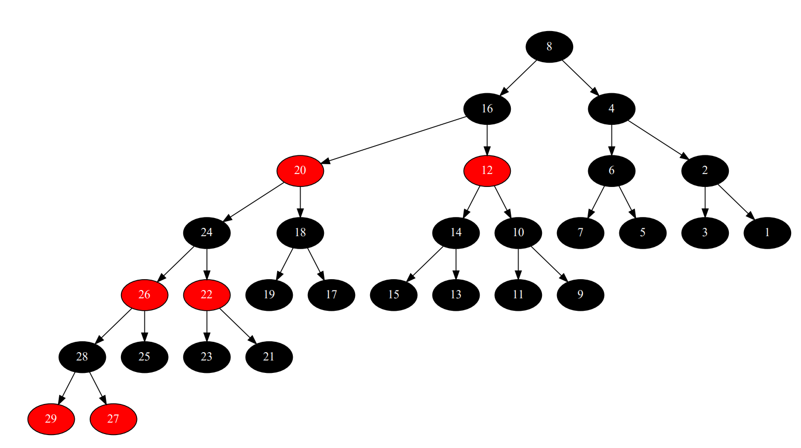
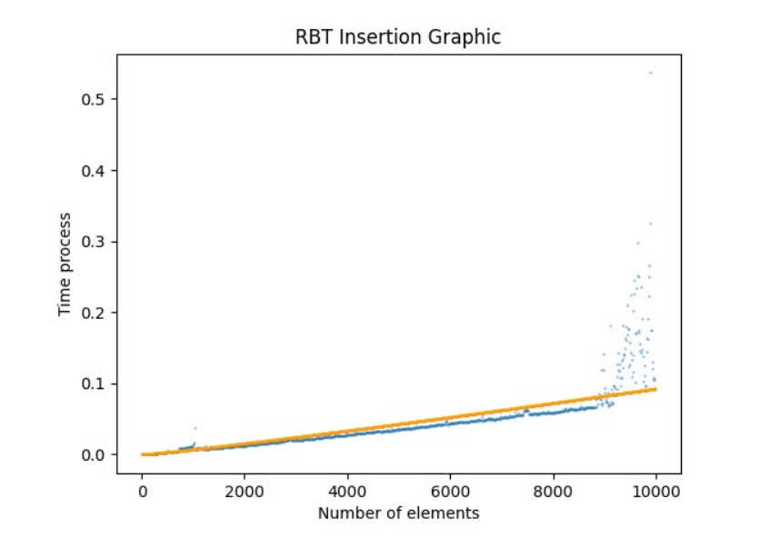
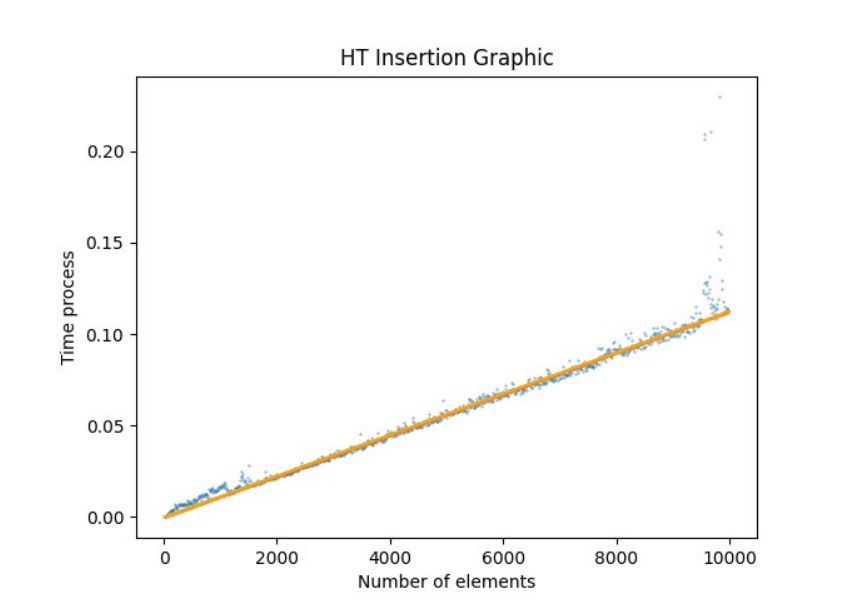
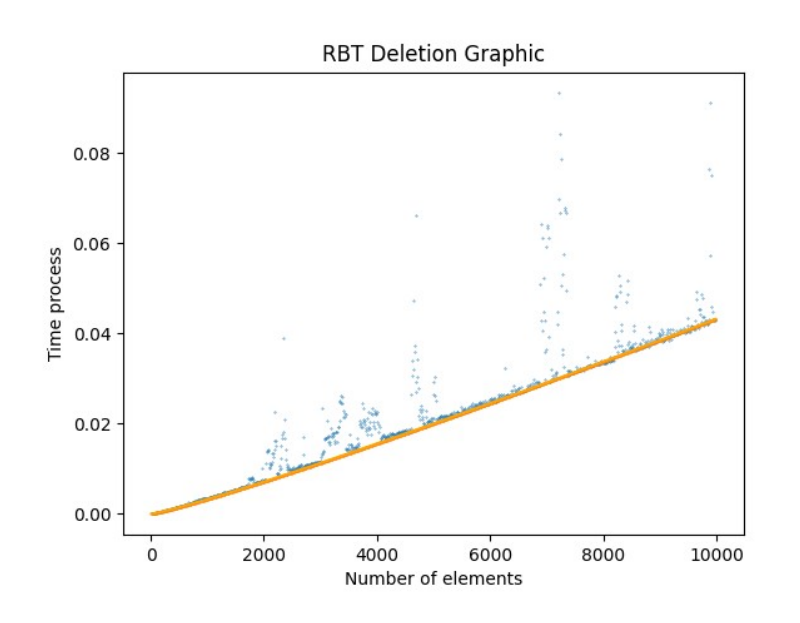
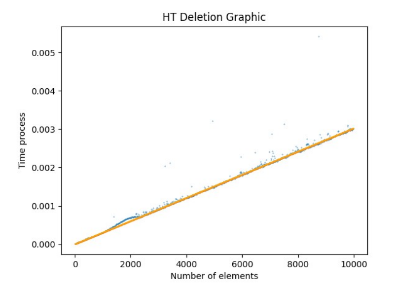
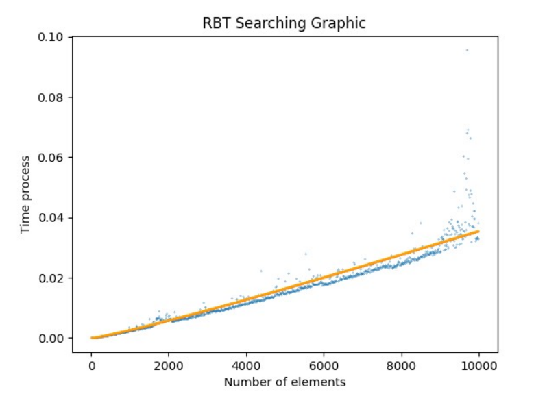
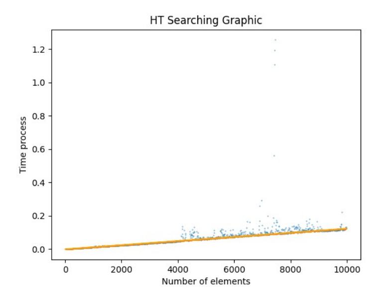

# Course work of Algorithms and Data Structures
## RBT and HashTable (open address) realizations
+ RBT: https://en.wikipedia.org/wiki/Red–black_tree
+ HashTable: https://en.wikipedia.org/wiki/Hash_table
## Task
Visualize RBT and compare algs by plots, write unitTests
## Results:
+ Visualization:

+ Graphics:

